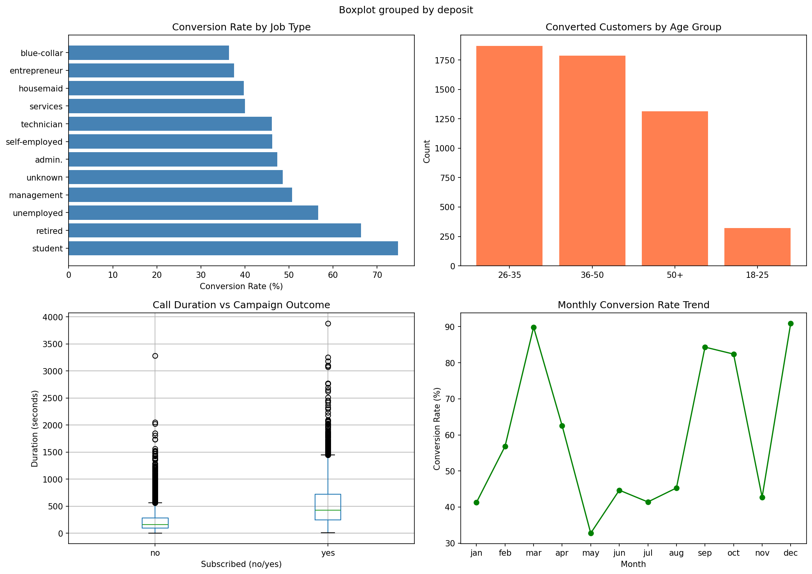

# Bank Marketing Campaign Performance Analysis

## Overview
Analyzed a real-world CRM dataset of 11,162 bank customers to evaluate marketing campaign effectiveness and identify high-value conversion segments.

## Tools & Technologies
- Python, Pandas, NumPy
- Matplotlib, Seaborn
- SQL (SQLite)

## Key Findings
- Overall campaign conversion rate: 47.38%
- Top customer segments drove 55.8% of total conversions
- Converted customers had avg call duration of 537 sec vs 223 sec for non-converted
- Recommendation: Focus on high-converting job segments and peak response months

## Dashboard Preview

## Dataset
Bank Marketing Dataset — Kaggle
